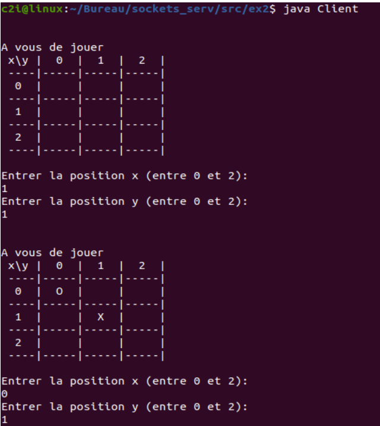
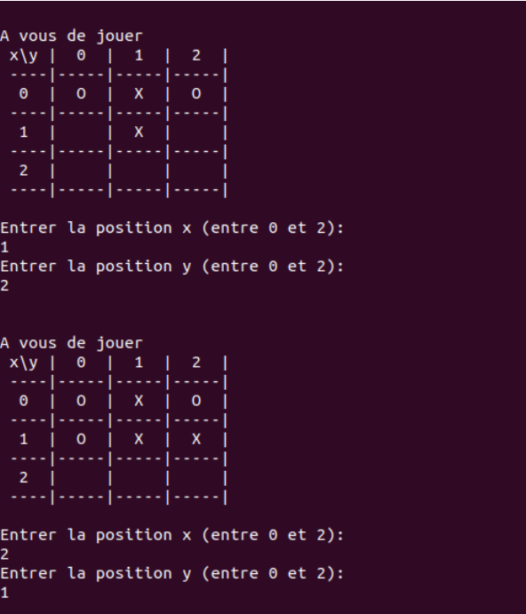
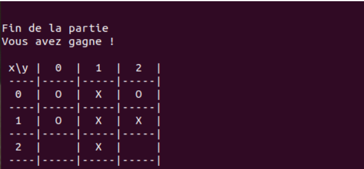
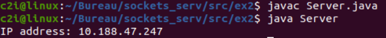
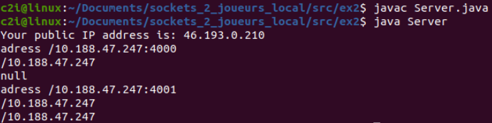
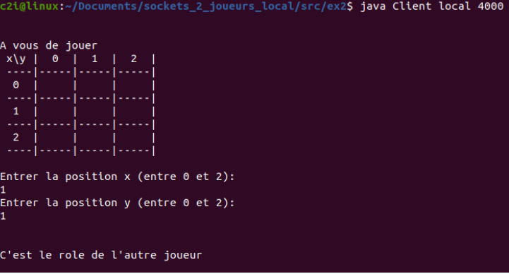
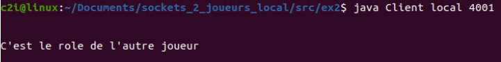
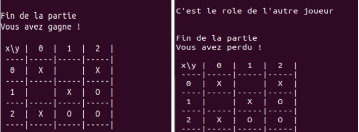

# Jeu-de-Morpions--Sockets

- Exercice 1 : `Hello en JAVA`
- Exercice 2 : `Jeu de Morpions`

Le sujet de cet exercice consiste à développer un jeu de Morpion en utilisant des Sockets en `JAVA`, qui sera joué sur deux postes différents. Les étapes à suivre comprennent la modélisation du jeu, la création d'un serveur qui jouera aléatoirement dans une première phase, et permettra à un autre joueur de jouer dans une seconde phase. Les échanges d'informations entre le client et le serveur doivent également être définis.

##  Classe `Client`  
La  code de la classe `Client` est un programme Java qui implémente un client pour un jeu de Morpion. Le joueur entre des coordonnées pour placer son symbole (croix) sur un plateau de jeu. Les coordonnées sont envoyées au serveur via des datagrammes `UDP` (User Datagram Protocol), et le serveur renvoie la réponse appropriée (par exemple, "<em>`Coup invalide` </em>" ou "<em>`Vous avez gagné !`</em>").

Le code utilise des classes Java standard pour les entrées/sorties et la sérialisation/désérialisation d'objets. Voici les choix techniques effectués :

- La classe `DatagramSocket` est utilisée pour créer une socket cliente pour envoyer et recevoir des datagrammes UDP.
- Les `ports` de client et de serveur sont fixés à 4001 et 4000, respectivement.
- La classe `InetAddress` est utilisée pour représenter l'`adresse IP` du serveur, qui est dans ce cas "`localhost`" (c'est-à-dire le même ordinateur que le client)
- La classe `Scanner` est utilisée pour lire les entrées de l'utilisateur à partir de la console.
- Les `données du jeu de Morpion` sont stockées dans un objet `MorpionData`, qui est sérialisé en bytes pour l'envoi au serveur.
- Le `paquet de datagramme` envoyé contient les bytes sérialisés de l'objet MorpionData, l'adresse IP du serveur et le port du serveur.
- Le paquet de datagramme reçu contient des bytes, qui sont convertis en une chaîne de caractères pour l'affichage dans la console.
- La réception du paquet de datagramme est bloquante jusqu'à ce qu'un paquet soit reçu.
- La boucle de jeu continue tant que le message reçu ne commence pas par "Fin". Si le message commence par cette chaîne, le programme se termine avec `System.exit(0)`.

## Classe `Server` 
Le code de la classe serveur est une implémentation du jeu Morpion en réseau. Le serveur est implémenté pour écouter les paquets qui viennent d'un client, pour ensuite analyser la requête du client et envoyer une réponse au client.

La classe `serveur` a les membres de classe suivants:

- `grid`: Tableau à deux dimensions pour stocker les informations de l'état actuel du jeu (3x3).
- `eog` (End of Game): Indicateur réglé sur true lorsque la partie est terminée.
- `serverSocket`: Objet `DatagramSocket` pour écouter les paquets entrants du client.
- `serverPort`: Port utilisé par le serveur pour écouter les paquets entrants du client.
- `clientPort`: Port utilisé par le serveur pour envoyer des paquets au client.
- `address`: Adresse IP du client.

### Méthodes
- `main()`: Initialise la grille et le socket du serveur, affiche l'adresse IP locale du serveur.
- `socketSend()`: Envoie un message initial "À vous de jouer" au client.
- `socketReceive()`: Écoute les paquets entrants du client, vérifie les coordonnées de la case choisie et envoie une réponse appropriée au client.
- `finPartie()`: Vérifie si le jeu est terminé et envoie une réponse appropriée au client.

Pour la communication avec le client, l'objet MorpionData est utilisé pour transmettre les coordonnées de la case que le client a choisie. Les messages envoyés par le serveur incluent également une chaîne qui représente l'état actuel de la grille. Les messages envoyés au client sont envoyés en tant que paquets UDP.

## Choix techniques Client vs Client en Local

### Classe `Client`

Ce code Java est un client pour un jeu de Morpion. Voici une explication des choix techniques effectués :

- Le code utilise les classes Java `DatagramSocket` et `DatagramPacket` pour communiquer avec le serveur en utilisant le protocole UDP. UDP est un choix approprié pour ce type de jeu en temps réel, car il est plus rapide que TCP et nécessite moins de ressources réseau.
- La classe `InetAddress` est utilisée pour spécifier l'adresse IP du serveur. L'adresse IP est fournie par l'utilisateur en tant qu'argument de ligne de commande. Si l'utilisateur fournit le mot "local" à la place de l'adresse IP, l'adresse IP locale de la machine est utilisée.
- La classe `Scanner` est utilisée pour lire l'entrée utilisateur à partir de la console. L'entrée utilisateur est utilisée pour déterminer la position du joueur dans le jeu de Morpion.
- Les classes `ByteArrayOutputStream` et `ObjectOutputStream` sont utilisées pour convertir un objet `MorpionData` en tableau de bytes, qui est ensuite envoyé au serveur dans un `DatagramPacket`.
- La méthode `socketReceive()` est utilisée pour attendre et recevoir les messages du serveur. Cette méthode utilise un `DatagramPacket` pour recevoir les données du serveur et les convertit en chaîne de caractères.
- La méthode `socketSend()` est utilisée pour envoyer les données du joueur au serveur. Cette méthode utilise un objet `MorpionData` et le convertit en tableau de bytes avant de l'envoyer dans un `DatagramPacket`.
- Le code utilise des instructions conditionnelles pour gérer les messages du serveur. Si le message du serveur commence par "Fin", le jeu se termine et le programme se ferme.

### Classe `Server`

Ce code est un programme en Java qui implémente le jeu du Tic Tac Toe (morpion) à travers le réseau. Il utilise la communication via des sockets datagrammes pour permettre à deux joueurs de jouer à distance.

Voici une explication des choix techniques effectués dans ce code :

- La classe `Server` est la classe principale qui contient la méthode `main()` qui démarre le serveur. Cette classe contient également les méthodes pour envoyer et recevoir des données via les sockets datagrammes.
- La grille de jeu est représentée par une matrice 3x3 de chaînes de caractères. La chaîne de caractères "X" est utilisée pour représenter les coups du joueur 1, tandis que la chaîne de caractères "O" est utilisée pour représenter les coups du joueur 2.
- La variable `eog` est une variable booléenne qui est utilisée pour indiquer si la partie est terminée.
- Les variables `serverPort`, `p1Port` et `p2Port` sont des entiers qui représentent les ports utilisés pour la communication entre le serveur et les deux joueurs.
- Les variables `p1Address` et `p2Address` sont des objets `InetAddress` qui représentent les adresses IP des joueurs 1 et 2 respectivement.
- La méthode `main()` commence par initialiser la grille de jeu avec des chaînes de caractères vides. Elle utilise également la bibliothèque `java.net` pour récupérer l'adresse IP publique du serveur à partir du site https://checkip.amazonaws.com.
- La méthode `socketSend()` est utilisée pour envoyer des données via les sockets datagrammes. Cette méthode prend en paramètre une chaîne de caractères qui représente le message à envoyer. Elle utilise la méthode `getBytes()` de la classe `String` pour convertir le message en un tableau de bytes, qui est ensuite encapsulé dans un objet `DatagramPacket` et envoyé via la méthode `send()` de l'objet `DatagramSocket`.
- La méthode `socketReceive()` est utilisée pour recevoir des données via les sockets datagrammes. Elle utilise la méthode `receive()` de l'objet `DatagramSocket` pour recevoir un objet `DatagramPacket`, qui est ensuite désérialisé à l'aide d'un objet `ObjectInputStream`. Les données désérialisées sont stockées dans un objet `MorpionData`, qui contient les coordonnées du coup joué par le joueur.
- La méthode `finPartie()` est utilisée pour déterminer si la partie est terminée et si oui, qui a gagné. Elle vérifie toutes les lignes, colonnes et diagonales de la grille pour voir si l'un des joueurs à aligner trois symboles identiques. Si c'est le cas, elle envoie un message de fin de partie aux deux joueurs en utilisant la méthode `socketSendP()`. Si personne n'a gagné et que la grille est pleine, la partie est considérée comme un match nul.
- La méthode `socketSendP()` est utilisée pour envoyer un message de fin de partie à un joueur spécifique. Cette méthode prend en paramètre une chaîne de caractères qui représente le message à envoyer et un entier qui représente le numéro du joueur (1 ou 2). Elle utilise les variables `p1Address`, `p2Address` et `p1Port`, `p2Port`.

## Classe MorpionData

Ce code représente une classe Java appelée "MorpionData", implémentant l'interface `Serializable`. La classe est conçue pour représenter les données échangées entre le client et le serveur dans le jeu du morpion.

### Attributs

La classe contient deux attributs de type entier privés, `posX` et `posY`, qui décrivent la position d'un joueur sur le plateau de jeu du morpion.

### Constructeur

Un constructeur est inclus dans la classe, prenant en paramètre les deux positions et initialisant les attributs correspondants.

### Méthodes publiques

Deux méthodes publiques, `getPosX` et `getPosY`, sont disponibles pour permettre l'accès aux positions privées des joueurs depuis l'extérieur de la classe.

### Interface `Serializable`

En implémentant l'interface `Serializable`, cette classe peut être facilement sérialisée et désérialisée à l'aide de flux d'octets, facilitant ainsi son envoi et sa réception à travers le réseau entre le client et le serveur.

## Résultats et tests

### Exercice 2
#### `Client` vs `Serveur`
- Commencer par compiler tout les fichier  puis lancer le client puis le serveur
  

  

  

  

- Commencer par compiler tout les fichier  puis lancer le serveur puis le premier client et le deuxième client.

    

    
  
    

- après une longue séquence de jeu le deuxième joueur a perdu

    

  
# Conclusion

En résumé, nous avons examiné le jeu du morpion basé sur un modèle client-serveur en utilisant la classe `java.net.DatagramSocket` pour la communication entre les deux parties. Nous avons exploré les choix techniques effectués dans chaque cas et étudié la classe `MorpionData` qui stocke les coordonnées de chaque coup effectué par le joueur. Les tests ont démontré que la communication entre les programmes client et serveur fonctionne correctement. Cependant, ce programme présente des limites en termes de sécurité et de robustesse, notamment l'absence d'authentification et de chiffrement. Les perspectives d'amélioration pourraient inclure l'ajout de fonctionnalités visant à renforcer la sécurité et la résilience aux attaques. De plus, le développement de ce jeu peut contribuer à l'amélioration des compétences des programmeurs en Java et à la compréhension des principes de la programmation orientée objet (POO) et des protocoles de réseau tels que le protocole de datagramme utilisateur (UDP).

